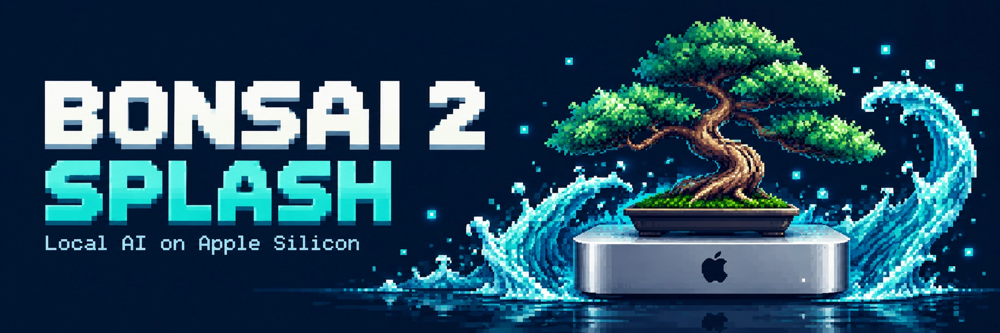
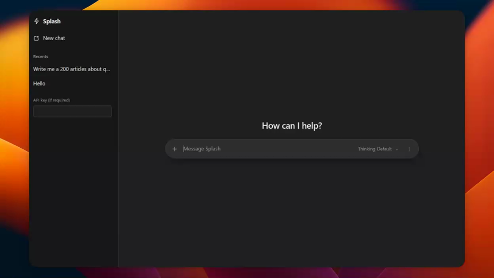

# Bonsai 2 27B on Apple Silicon

<div align="center">
  
</div>

> [!IMPORTANT]
> **▶️ Live demo — the web UI at real speed.**
> Screen recording of the built-in chat page generating at **1× speed (no
> time-lapse)** on a **Mac mini M6, 24 GB** — what you see is exactly the
> speed you get on comparable hardware.

<div align="center">
  
  <br>
  <sub><i>The built-in chat page at <code>localhost:8080</code> — generation shown at 1× speed, Mac mini M6 · 24 GB</i></sub>
</div>

A ready-to-run demo for serving **Bonsai 2 27B** — a ternary-weight model with
vision, native tool calling and reasoning — on an Apple Silicon Mac, as an
OpenAI-compatible local API with a built-in chat page.

It runs on the [Splash](https://github.com/incoai/splash) engine
(`brew install incoai/tap/splash`), which is **3–4x faster than the
llama.cpp-based setup this demo replaces**, on the same weights and the same
machine. Measured numbers and methodology: **[BENCHMARKS.md](BENCHMARKS.md)**.

```bash
git clone https://github.com/nikola66/bonsai2-splash
cd bonsai2-splash
./scripts/start_llama_server.sh     # then open http://localhost:8080
```

First run downloads ~10 GB from Hugging Face (weights, speculative draft, vision
projector) into Splash's cache. Later starts load in about 4 seconds.

## What you get

- **OpenAI-compatible API** at `/v1` — chat completions with streaming and tool
  calls, plus `/health`, `/ready` and `/status`.
- **A built-in chat page** at `/` — reasoning-effort picker, image and PDF
  attachments, per-conversation sampling settings.
- **An Ollama-compatible bridge** on port 11434, so existing Ollama clients and
  tooling work unchanged.
- **Reasoning ("thinking")** streamed separately as `reasoning_content`, with
  per-request control via `reasoning_effort` (server default: `low`).
- **Vision** — images and PDFs, with a token cap you control.
- **Native tool calling** — OpenAI `tool_calls` with full round-trips.
- **A launchd service** that starts everything at login and releases all model
  memory on stop.

## Requirements

| | |
|---|---|
| Hardware | Apple Silicon, **M3 or newer** |
| macOS | 26.4 or newer |
| Memory | 24 GB works well; 16 GB is usable with a smaller context (see [Context](#context-window)) |
| Engine | `brew install incoai/tap/splash` |

There is no CPU, Windows or Linux path — Splash is Apple-only.

## Install

```bash
git clone https://github.com/nikola66/bonsai2-splash
cd bonsai2-splash

# 1. The engine
brew install incoai/tap/splash

# 2. Python env for the Ollama bridge (httpx only)
python3 -m venv .venv && .venv/bin/pip install httpx

# 3. Run it in the foreground
./scripts/start_llama_server.sh
```

Open **http://localhost:8080**. Press Ctrl+C to stop.

To run it as a service that starts at login instead:

```bash
./install-service.sh    # writes launchd agents for this checkout, then starts
./bonsai.sh status      # agents, health, memory
./bonsai.sh stop        # releases all model memory
```

The plists embed this checkout's absolute path, so re-run `./install-service.sh`
after moving or renaming the directory. Uninstall with `./bonsai.sh uninstall`.

## Using it from your apps

| Client | Setting |
|---|---|
| Chat page | `http://localhost:8080/` |
| OpenAI SDK / apps | base URL `http://localhost:8080/v1`, any API key, model `bonsai-2-27b` |
| Ollama | host `localhost:11434`, model `bonsai-2-27b:latest` (any name resolves) |

```bash
curl -s http://localhost:8080/v1/chat/completions \
  -H 'Content-Type: application/json' \
  -d '{"model":"bonsai-2-27b","reasoning_effort":"none","max_tokens":200,
       "messages":[{"role":"user","content":"Write a Python quicksort"}]}' \
  | python3 -m json.tool | grep -A8 timings
```

The `timings` object in every response is the authoritative performance data —
use it rather than guessing from wall-clock time.

**MCP tools are configured in your client**, not here. The server serves a model;
Splash does not host MCP servers. Your agent or IDE's own MCP config is the place
for that.

## Configuration

The knobs you are most likely to want, all optional:

| Variable | Default | Purpose |
|---|---|---|
| `BONSAI_HOST` | `127.0.0.1` | Bind address. `0.0.0.0` = all interfaces. |
| `PORT` | `8080` | HTTP port. |
| `BONSAI_CTX` | RAM-tiered, 8K–128K | Context window (max 262144). |
| `BONSAI_SPLASH_MODEL` | `prism-ml/Ternary-Bonsai-2-27B-gguf:PQ2_0` | Which model to serve. |
| `BONSAI_IMAGE_MAX_TOKENS` | `1024` | Vision tokens per image; `0` = uncapped (4096). |
| `BONSAI_IDLE_RELEASE` | `off` | Free model memory after N idle (`30s`, `10m`, …). |
| `BONSAI_KV_FORMAT` | `int8` | KV cache: `int8` (small) or `bf16` (full precision). |

Full reference, including legacy variables that are accepted but ignored:
**[environment_variables.md](environment_variables.md)**.

For a persistent setup, copy `bonsai.env.example` to `bonsai.env` — both
`bonsai.sh` and the launchd service read it, so they always agree. The
environment takes precedence over the file.

### Three choices worth deciding on

**Image detail.** Large images are downscaled to 1024 vision tokens by default:
fast, but fine detail in screenshots is lost. Set `BONSAI_IMAGE_MAX_TOKENS=0`
for full detail (4096 tokens) — better for OCR and small text, slower per image.

**Idle memory.** By default the model stays resident, so the first request is
always instant. On a 24 GB Mac, `BONSAI_IDLE_RELEASE=10m` returns ~11 GB while
idle, at the cost of a few seconds on the first request after a long pause.

**Context window.** See below.

### Context window

Default is RAM-tiered (32768 on a 24 GB machine); the launchd service pins
65536, or the value in `.bonsai-ctx` written by the chat page's context slider
(8192–262144). Force one for any run:

```bash
BONSAI_CTX=131072 ./scripts/start_llama_server.sh
```

Changing the context restarts the server — the weights reload, which takes a few
seconds. That is expected.

Context is bounded by your memory, not only by the model. Splash's native limit
is 262144 tokens; on a 24 GB Mac the memory plan allows about 188K. At `int8` KV
the cache costs ~32 KiB/token, so 64K ≈ 2 GB and 262K ≈ 8 GB. On a tight machine
with a long context, `BONSAI_MAX_CACHE_DISK=16G` lets blocks spill to SSD.

### Exposing the server

**The server and the bridge have no authentication.** The bind address is the
only access control, so they default to loopback.

To reach them from your own devices, the sensible option is a mesh VPN such as
Tailscale — bind to its address and the network becomes the perimeter:

```bash
cp bonsai.env.example bonsai.env
# set: BONSAI_HOST="$(tailscale ip -4)"
./bonsai.sh restart
```

Avoid `0.0.0.0` on an untrusted network. Splash supports `--api-key` (and
`SPLASH_API_KEY`) if you need real authentication — pass it as a trailing
argument to `start_llama_server.sh`.

## Models

The default is **`prism-ml/Ternary-Bonsai-2-27B-gguf:PQ2_0`** (6.75 GiB of
weights) plus its paired DFlash2 draft and vision projector — about 10 GB in
total, downloaded by Splash into its own cache on first run.

Override with `BONSAI_SPLASH_MODEL` for any GGUF repository Splash can identify
(`OWNER/REPO:VARIANT`), for example
`unsloth/Qwen3.8-27B-GGUF:UD-Q4_K_M`. Local `.gguf` files are not loadable:
Splash identifies models from upstream repositories.

Collection: <https://huggingface.co/collections/prism-ml/bonsai-27b>

Only the 27B Bonsai 2 model is supported here. `BONSAI_FAMILY` and `BONSAI_MODEL`
are kept for compatibility with older configs and validated on startup, so a
stale setting fails with a clear message instead of a confusing one.

## Troubleshooting

**`splash not found`** — `brew install incoai/tap/splash`. The launcher also
searches `/opt/homebrew/bin` directly, since launchd's minimal `PATH` misses it.

**First run looks stuck** — it is downloading ~10 GB. Progress is printed.

**A server is already running on port 8080** — `kill $(lsof -ti TCP:8080)`, or
`./bonsai.sh stop` for the service.

**Everything slower than expected** — check macOS Low Power Mode (System
Settings → Battery); it throttles inference hard. Then read the `timings`
object before blaming the hardware: thinking tokens dominate "slow answers", so
cap them with `reasoning_effort` or the chat page's effort picker.

**Service starts but is unreachable** — if you bound to a VPN address, the
interface must exist first; the agent retries until it does. `./bonsai.sh status`
and `logs/bonsai-server.err.log` show what happened.

**Something needs embeddings** — Splash does not serve them: `/v1/embeddings`
returns 404, and the bridge's `/api/embed` returns 501 with
`embeddings are not served by the Splash engine`. The llama.cpp setup this
replaces did serve them.

## How it fits together

```
bonsai.sh                start / stop / status / install    ← the entry point
install-service.sh       generate launchd agents for this checkout
bonsai-service.sh        service environment + flags
bonsai.env               your bind address and ports (copy from the example)
ollama_bridge.py         Ollama API → OpenAI translation
scripts/
  start_llama_server.sh  server launcher (translates flags, then runs splash serve)
  common.sh              shared launcher logic
  benchmark.py           measure a running server and emit a report
```

Flow: `bonsai.sh` → `bonsai-service.sh` → `scripts/start_llama_server.sh` →
`splash serve`. The bridge sits beside the server and translates Ollama requests
to its OpenAI API. Any Splash-native flag can be passed through:

```bash
./scripts/start_llama_server.sh --max-memory 20G --language-only
```

## Further reading

- **[BENCHMARKS.md](BENCHMARKS.md)** — measured performance, the comparison
  against the llama.cpp setup, and benchmarking pitfalls (the prefix cache one
  will bite you).
- **[AGENTS.md](AGENTS.md)** — the same hardware knobs and defaults, written for
  an AI coding agent setting this up.
- **[environment_variables.md](environment_variables.md)** — every variable,
  including legacy ones that are ignored.

## License

MIT — see [LICENSE](LICENSE). The model weights and the Splash engine carry
their own licenses; this repo covers only the setup scripts and docs.